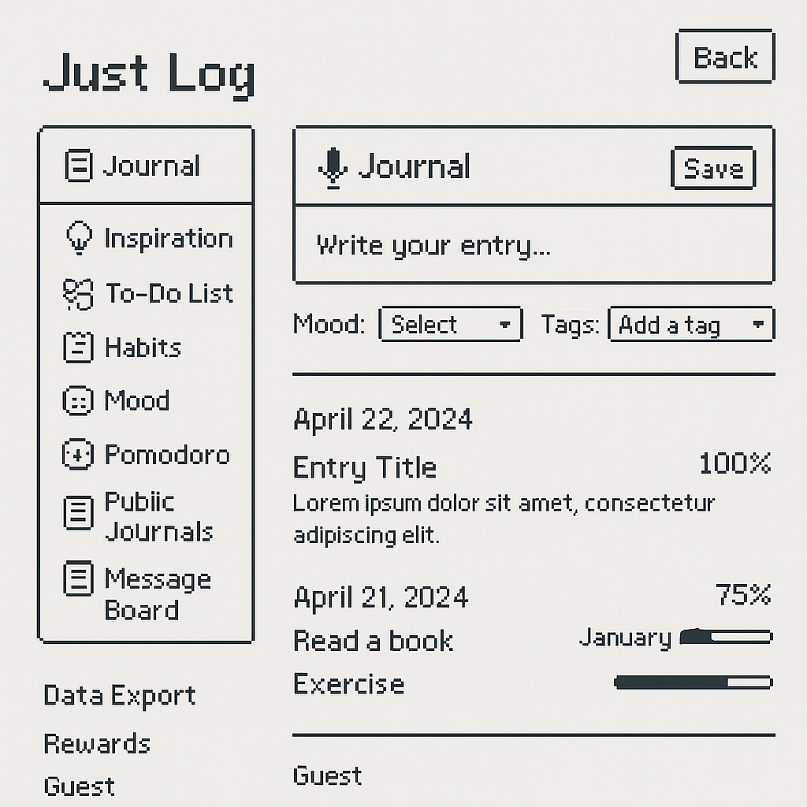

# Project Name: Just Log
## Design Mockup

## Application Description

**Just Log** is a calm, minimalist web application built to be both a personal sanctuary and a productivity companion. It offers tools for journaling, inspiration capture, mood tracking, habit formation, focused work, and self-reflection — all in one place.

Originally inspired by the need for a peaceful space for thought organization, Just Log has evolved into a fully functional personal growth platform. It allows not only me but anyone to track their daily habits, log private or public thoughts, reflect on emotional trends, and stay organized and productive.

## Features & Technologies (might not include all)

### 1. **Journal System (Text + Voice)**
- Write personal or public entries using a Markdown-based editor
- Use voice input for quick note-taking via speech-to-text
- Filter and view past logs by tag, mood, or date

### 2. **Inspiration Wall**
- A dedicated space to store random thoughts, ideas, quotes, and dreams
- Supports color-coded tags and optional public display
- Quick input mode for rapid idea capture

### 3. **Mood Tagging & Visualization**
- Choose a mood when journaling (e.g., happy, anxious, calm, etc.)
- Weekly/monthly mood trends visualized with bar charts and timelines
- Helps identify emotional patterns over time

### 4. **Pomodoro Focus Timer**
- Classic Pomodoro technique (25 min focus / 5 min break)
- Optional sound and vibration notifications
- Completed sessions can log automatically to the habit tracker

### 5. **Habit Tracker**
- Visual heatmap calendar for tracking daily habits (e.g., reading, exercise)
- Tracks streaks and overall progress
- Fully customizable habit list per user

### 6. **To-Do List**
- Simple daily task manager
- Tasks can be marked as complete and optionally logged into the journal
- Deadline reminders and recurring tasks supported

### 7. **Achievement & Reward System**
- Completing habits and tasks earns points and digital badges
- Encourages consistency and motivation through visual progress

### 8. **Data Export**
- All logs, habits, and mood data can be exported in `.json` or `.md` format
- Designed for long-term preservation, offline use, or syncing with GitHub

### 9. **User Authentication**
- Optional sign-in system (guest users can browse and leave comments)
- Registered users get a private dashboard and encrypted data
- OAuth or email/password-based login with full user separation

### 10. **Public Journal Wall**
- Users can opt to publish entries anonymously or under a display name
- Browse and interact with other users' public logs
- Promotes anonymous empathy and quiet community reflection

### 11. **Visitor Message Board & Comment System**
- Visitors can leave messages on the profile or about page
- Blog posts support comments for discussion and feedback
- Anti-spam filtering and basic moderation included

---

## Timeline

| Date       | Milestone                                             |
|------------|--------------------------------------------------------|
| Apr 21     | Submit project proposal and initial design mockup      |
| Apr 23  | Build core structure: homepage, journal, inspiration   |
| Apr  25 | Complete editor, voice input, Pomodoro, and mood chart |
| Apr 27    | Implement To-Do, Habit Tracker, and reward system      |
| Apr 30  | Develop comment system, user auth, and data export     |
| May 1    | Public journal wall, polish UI, responsive design      |
| May 2| Final testing, bug fixing, deployment                  |

---

## Tech Stack

| Component           | Technology                        |
|---------------------|------------------------------------|
| Frontend            | React                             |
| State Management    | React Hooks                       |
| Voice Input         | Web Speech API                     |
| Charts & Visuals    | Chart.js, Calendar Heatmap         |
| Backend & Storage   | Express + MongoDB (simulated)      |
| Authentication      | Custom Auth (simulated)            |
| Data Export         | Blob API + Markdown serialization  |

---

## How to Run the Project

### Prerequisites
- Node.js and npm installed

### Installation
1. Clone the repository
```bash
git clone https://github.com/yourusername/justlog.git
cd justlog
```

2. Install dependencies
```bash
npm install
```

### Running the Application
1. Start the development server (frontend)
```bash
npm start
```

2. Start the API server (backend)
```bash
npm run server
```

3. Or run both concurrently
```bash
npm run dev
```

### Building for Production
```bash
npm run build
```

The frontend will be available at http://localhost:3000 and the API server at http://localhost:5000.

## Project Structure
```
justlog/
├── public/               # Static files
├── src/                  # Source code
│   ├── api/              # API server and models
│   ├── components/       # React components
│   ├── pages/            # Page components
│   ├── styles/           # CSS files
│   ├── utils/            # Utility functions
│   ├── App.js            # Main App component
│   └── index.js          # Entry point
├── package.json          # Project dependencies
└── README.md             # Project documentation
```

## Vision

Just Log is designed to be a personal companion in an increasingly noisy world — a digital space that respects quiet reflection while enabling real productivity. It brings together journaling, habit tracking, mood awareness, and focused work into a unified experience. While it began as a personal website, it is now open to anyone seeking clarity, rhythm, and expression in their everyday lives.
